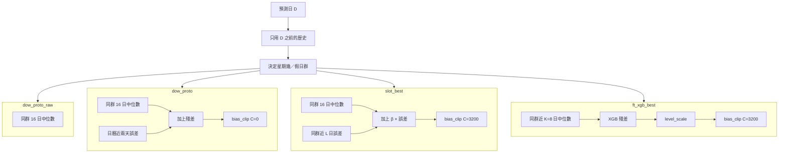

# 預測模型架構說明（白話版）

這份文件說明 `discrete_dow_cluster` **目前實際在跑的模型**：怎麼分群、怎麼一天一天預測、**四種預測方法**差在哪、最後的**雙向偏差校正（bias_clip）**怎麼加，以及**競賽 Total_Score** 怎麼算。

| 項目 | 位置 |
|------|------|
| 主實驗腳本 | `app/experiment_slot_vs_finetune.py` |
| 設定檔 | `settings.yaml`（`dow.*`、`splits.*`、天氣 lag） |
| 評分 | `domain/scoring.py` |
| 四種方法 | `dow_proto_raw` → `dow_proto` → `slot_best` → `ft_xgb_best` |

---

## 一句話總覽

```text
依「星期幾／假日」分群
  → 每天獨立預測 24 小時（144 個 10 分鐘點）
  → 先貼「同群歷史中位數曲線」當底
  → 各方法再加不同校正（殘差 / slot / XGB）
  → 除 raw 外的三種再讀 settings 做「雙向偏差校正 clip ±C」
       （ft 先做 level_scale；含前置 lookback 天估 g；raw 不加）
  → 抽出 Peak / Ramp 指標，用公式算 Total_Score（越低越好）
```

**沒有**把週五 23:50 的預測值連續預測到週六 00:00；跨日傳遞的是「前幾天的實際誤差資訊」，不是上一預測點的數值。

---

## 1. 共同規則（四種方法都遵守）

### 1.1 硬分群：一天只屬一群

每筆 10 分鐘負載點只進一群（互斥）：

| cluster | 意思 | 怎麼定 |
|---------|------|--------|
| 0–6 | 週一～週日 | 依當天星期幾 |
| 7 | 國定假日 | `holidays.csv` 裡 `kind=holiday` |

- 國定假日整天進 cluster 7，不再算星期幾。
- **補班日**不當假日，仍依星期幾分群。
- 建原型、slot、XGB 訓練時，**原則上不跨群混用**資料。
- 例外：`dow_proto` 的日曆殘差、以及雙向偏差校正，會看**日曆近兩天**（可跨星期，例如預測週六會用到週五）。

### 1.2 分開日預測：一天做一次

評測窗裡，每一天 **D** 都重跑一遍：

1. 訓練截止點 = 當天 0:00（只用比 D 更早的歷史）
2. 只預測當天 24 小時
3. 多天結果再串起來（例如 8/6、8/7、8/8 各預測一次，不是一次連預 72 小時）

因此：預測 8/7 時，可以用到 8/6 整天的**實際**負載——這是**日前滾動**，不是「早上一次看三天」。

週五接週六時：兩天用不同群的原型，午夜**沒有強制平滑**；圖上可能出現階躍，屬預期行為。

### 1.3 Valid / Test

| 用途 | 預設區間 |
|------|----------|
| Valid set | 2026-07-01～07-31 |
| Test set | 2026-08-01 起 |


### 1.4 共同積木：中位數日曲線

對某個星期幾／假日群：

1. 在截止日之前，找出該群出現過的歷史日（由近到遠）
2. 取最近 N 天（一般 N=16；FT-XGB 預設 **K=8**）
3. 每個時段（一天 144 格）對這 N 天取**中位數** → 得到一條「典型日曲線」
4. 預測當天：看當天屬於哪一群，把該群曲線整條貼上去

---

## 2. 四種方法長什麼樣

```text
dow_proto_raw     只用同群 16 日中位數（對照用，不加校正）
       ↓
dow_proto         同上 + 日曆近兩天「實際 − 原型」再抬／壓一點
       ↓          + bias_clip（定案 C=0 → 此步關閉）
slot_best         同上底板 + 同星期幾歷史誤差 × β
       ↓          + bias_clip（定案 C=3200）
ft_xgb_best       同群近 K=8 日中位數 + XGB 殘差（天氣等）
                  + level_scale + bias_clip（定案 C=3200）
```

| 方法 | 底板 | 額外校正 | bias_clip | 超參 |
|----|------|----------|-----------|------|
| `dow_proto_raw` | 同群 16 日中位數 | 無 | **否** | 固定 |
| `dow_proto` | 同群 16 日中位數 | 日曆 D−1、D−2 殘差 | **是**（C=0） | 固定 lookback=2、β=1 |
| `slot_best` | 同群 16 日中位數 | 同群最近 L 日殘差 × β | **是**（C=3200） | valid 選 L、β（凍結 L=6、β=1.0） |
| `ft_xgb_best` | 同群最近 **K=8** 日中位數 | 同群 XGB 殘差 + level_scale | **是**（C=3200） | skip 預設 K=8；valid 可掃 1–8 |

四種方法是**互斥對照**，不是串成一條路：`slot_best` 不做 XGB；`ft_xgb_best` 不做 slot。

---

## 3. 方法流程

### 3.1 `dow_proto_raw`：純原型

每天：取當天那一群、最近 16 天的中位數曲線，直接當預測。  
沒有天氣、沒有殘差、沒有雙向偏差校正。  
用途：看「光貼歷史形狀」會偏多少（實務上常整條偏低）。

### 3.2 `dow_proto`：原型 + 近兩天水位修正

1. 先做出跟 raw 一樣的中位數曲線。
2. 回頭看**日曆**昨天、前天（可跨星期）：
   - 用「當時若只貼原型」會怎麼錯
   - 每個時段算：實際 − 原型
3. 兩天對齊取平均，得到「近期每個時段大概低估／高估多少」。
4. 整條加回去（係數 β 預設 1，等於全加）。
5. 再套 bias_clip（目前 **C=0**，等於關掉）。

**例子**（預測 8/6～8/8）：

| 預測日 | 看誰的誤差 |
|--------|------------|
| 8/6 | 8/4、8/5 |
| 8/7 | 8/5、8/6 |
| 8/8 | 8/6、8/7 |

和 `slot_best` 的差別：這裡修的是**最近兩天整體水位**；slot 修的是**同一個星期幾**的歷史習慣偏差。

### 3.3 `slot_best`：同星期幾的習慣誤差

1. Valid 上掃描「回看幾個同群日 L」×「加多少 β」，選 MAE 最好的組合並凍結。
2. Test 每天：
   - 先貼 16 日中位數底板
   - 找預測日之前、最近 L 個**同一個星期幾／假日群**的日子
   - 那些日子上：實際 −（當時的）原型 → 每個時段平均
   - 預測 = 底板 + β × 這條誤差曲線
3. 再套 bias_clip（目前 **C=3200**）。

預設只回看同群（`slot_same_dow_only: true`），所以預測週六主要看歷史週六，不看週五。

### 3.4 `ft_xgb_best`：短窗原型 + XGB 補殘差

白話：用最近 K 個同群日畫基準曲線，再訓練 XGB 學「基準還差實際多少」，把差補回去。**不做 slot。**

1. **基準**：同群最近 K 日中位數（`--skip-xgb-valid` 預設 **K=8**；否則 valid 掃 `finetune_lookbacks` 1–8）。
2. **標籤**：實際 − 基準（學殘差，不是直接學負載）。
3. **特徵大概有**：一天裡第幾個時段、基準值、**前一天**同時段天氣、上一同群同時段負載等（不用預測當天的天氣預報）。
4. **pre** = 基準 + XGB 估的殘差（樣本太少則退回只用基準）。
5. **level_scale**：同 weekday 近期實際水準 / 當日 pre 水準，縮放後 clip 到 `[0.85, 1.15]`。
6. **bias_clip**：`final = pre_scaled + clip(g, -C, C)`（目前 **C=3200**）。

---

## 4. 雙向偏差校正（主程式正式三種方法的最後一步）

主實驗 `app/experiment_slot_vs_finetune.py` **固定**讀 `settings.yaml` → `dow.underest_penalty` 執行本步驟（不是選配外掛）。鍵名相容舊腳本，語意 = **bias_clip**（改預測），不是比賽評分裡的 `S_under_penalty`。

### 4.1 為什麼要加

近期若系統性**低估**就往上抬，**高估**就往下壓；幅度用上限 **C（MW）** 卡住。校正量加回**下一日**預測線。

- **有套用**：`dow_proto`、`slot_best`、`ft_xgb_best`
- **不套用**：`dow_proto_raw`；對照用的 `slot_lb*` / `ft_xgb_k*` 亦不套（加速）
- **C=0**：該方法關閉校正（目前只有 `dow_proto`）
- **C 太小會修不夠**：例 9/8–9/9 ft 約高估 2.0–2.6 GW，C=800 時 p 卡在 −800；定案改用較大 C 後 9/10–12 才明顯下壓

### 4.2 前置 lookback 天（例：目標 9/10–9/12）

`lookback_days: 2` 且 `include_prev_same_dow: true` 時，主方法會**額外先預測** refs 所需前置日（前置日本身不輸出最終曲線，只用來估 g）：

```text
pre_extra 例 = [9/3, 9/4, 9/5, 9/8, 9/9]   # 含日曆鄰近 + 上週同 weekday
pre_dates     = pre_extra ∪ [9/10, 9/11, 9/12]
```

用這些日的 `實際 − pre` 估 g，再回正 9/10–9/12。  
輸出：`curves_pre_with_extra_10min.csv`、`best_params.json` → `pre_extra_dates`。

### 4.3 定案設定（`settings.yaml`，與主程式一致）

```yaml
dow:
  forecast_mode: rolling          # refs 僅 <D 且已發生
  finetune_lookbacks: [1, 2, 3, 4, 5, 6, 7, 8]
  underest_penalty:               # 鍵名相容；語意 = bias_clip
    enable: true
    lookback_days: 2
    include_prev_same_dow: true
    same_dow_weight: 2.0          # 同 weekday / D-7 權重大
    calendar_weight: 1.0
    gap_mode: peak                # 尖峰 slot 混 tip_bias
    peak_blend: 0.65
    weekend_uplift_only: true     # 六日禁止下修
    cap_by_arm:                   # 由 tune_underest_cap 跨窗 Total 寫回
      dow_proto: 0                # （官方對齊評分後重掃）
      slot_best: 3200
      ft_xgb_best: 3200
  level_scale:                    # ft pre 水準縮放（抑季節漂移）
    enable: true
    k_same_dow: 2
    clip: [0.85, 1.15]
```

### 4.4 怎麼算

```text
refs = {D-1, D-2} ∪ {D-7}   # 假日目標則限同假日群
g = 加權 mean(實際 − pre)   # 同 weekday 權重較大；gap_mode=peak 時尖峰混 tip
p = clip(g, -C, C)
週末且 weekend_uplift_only：p = max(p, 0)
ft：先 level_scale(pre)，再 最終 = pre_scaled + p
```

輸出：`underest_penalty_by_day.csv`、`level_scale_by_day.csv`、`competition_scores.csv`、HTML。

### 4.5 換窗時怎麼重選 C

```text
python run_tune_cap.py --origins 2026-08-06,2026-09-10 --horizon-days 3 \
  --caps 0,800,1600,2400,2800,3200 --skip-xgb-valid --xgb-k 8
```

跨窗 **mean Total_Score** 最低的 C 寫回 `cap_by_arm`（可用 `--no-write-settings` 只掃不寫）。  
掃 C 用的 Total 必須與官方公式一致（見 §5）。

---

## 5. 競賽 Total_Score（官方簡報）

實作：`domain/scoring.py`。先把 10 分鐘曲線抽出日／夜尖峰 MW、尖峰時刻、最大上升／下降量，再算分。**越低越好。**

\[
\text{Total} = 0.6\,S_{\text{peak\_mw}} + 0.15\,S_{\text{peak\_time}} + 0.15\,S_{\text{ramp\_up}} + 0.1\,S_{\text{ramp\_down}} + S_{\text{under}}
\]

| 分項 | 權重 | 要點 |
|------|------|------|
| \(S_{\text{peak\_mw}}\) | 60% | 晝夜 Peak MW 的 MAPE **× 100%** 再平均 |
| \(S_{\text{peak\_time}}\) | 15% | \(\| \Delta T_{\text{分鐘}}\|/10)^{1.2}\)，晝夜平均 |
| \(S_{\text{ramp\_up}}\) | 15% | 全日最大 10 分鐘上升量 MAPE **× 100%** |
| \(S_{\text{ramp\_down}}\) | 10% | 全日最大 10 分鐘下降量 MAPE **× 100%** |
| \(S_{\text{under}}\) | 額外罰分 | 僅罰 **Day/Night Peak 與 RampUp 低估**（**不含 RampDown**） |

低估罰則（與 bias_clip 無關）：

\[
S_{\text{under}} = Penalty_{\text{peak}} + Penalty_{\text{ramp}}
\]

\[
Penalty_{\text{peak}} = \overline{\max(0,\,rel_{\text{day}})\times 0.2} + \overline{\max(0,\,rel_{\text{night}})\times 0.2}
\]

\[
Penalty_{\text{ramp}} = \overline{\max(0,\,rel_{\text{RampUp}})\times 0.2}
\]

主實驗依 Total 最低建議交卷方法；`app/tune_underest_cap.py` 依跨窗 mean Total 選 C。  
**注意：** 對齊官方後，舊 CSV／HTML 的分數尺度不可與新數字直比（Peak/Ramp 約 ×100）。

---

## 6. 單日流程圖



`raw` 停在中位數；另外三種方法在各自校正後再加 bias_clip（`p=clip(g,-C,C)`）。ft 多一步 level_scale。

---

## 7. 程式對照與常用指令

| 主題 | 檔案 |
|------|------|
| 分群 | `domain/cluster_assign.py` |
| 同群日檢索 | `domain/dow_data_split.py` |
| 中位數原型、讀資料 | `domain/train_dow_xgb.py`、`infra/data_io.py` |
| 分開日、slot、日曆殘差 | `domain/daily_predict.py` |
| Slot 殘差／bias_clip | `domain/slot_adapt.py` |
| FT-XGB | `domain/finetune.py`、`domain/dow_xgb.py` |
| 主實驗與出圖 | `app/experiment_slot_vs_finetune.py` |
| 掃 C | `app/tune_underest_cap.py` |
| 超參 | `settings.yaml` → `dow.proto_*`、`underest_penalty`、`slot_*`、`finetune_lookbacks` |

```text
cd discrete_dow_cluster

# ① 主實驗（四種方法 + 殘差圖 + bias_clip；C 用 settings 定案；FT K=8）
python run_experiment.py --origin 2026-09-10 --horizon-days 3 --skip-xgb-valid --open

# ② 換窗／重調：偏差上限 C 掃描（預設含 1600/2400/2800/3200）
python run_tune_cap.py --origins 2026-08-06,2026-09-10 --horizon-days 3 \
  --caps 0,800,1600,2400,2800,3200 --skip-xgb-valid --xgb-k 8
```

主實驗輸出：`outputs/slot_vs_ft_YYYYMMDD_YYYYMMDD/`  
掃 C 輸出：`outputs/tune_cap_*/`（含 `best_overall.csv` 等）

---

## 8. 建議閱讀順序

1. **§1** 分群 + 分開日 + 中位數底板（搞清楚「一天一天、一群一群」）
2. **§2–§3** 四種方法各多加了什麼（slot ≠ ft）
3. **§4** bias_clip 與 C 怎麼選（改預測）
4. **§5** 官方 Total_Score（選方法／掃 C 的準繩）
5. 看成績時：正式結論用 `*_best`；表上的 `slot_lb*`、`ft_xgb_k*` 只是對照，不要依 test 再重挑
